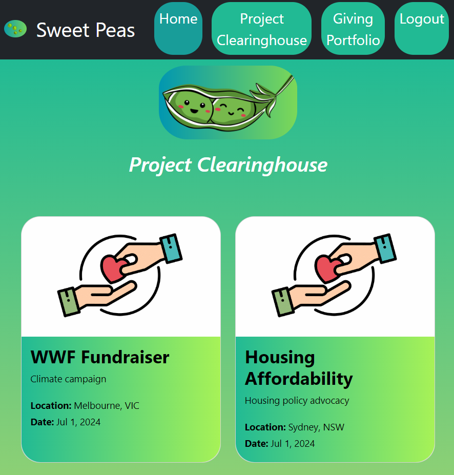

# Sweet Peas

## Description
Sweet Peas is a MERN stack application that allows users to browse charitable projects based on social impact type and geography. Users can log in/ sign up, view charitable projects in need of funding and create, edit and delete projects that they endorse. 

## User Story
AS an engaged philanthropist wanting to engage in collective giving
I WANT a platform to show me projects in need of funding and allow me to post my own projects I’m endorsing
SO THAT I may contribute to causes in need and promote causes I am passionate about

## Acceptance Criteria
GIVEN a collective giving application
WHEN I select login
THEN I am prompted to login, without an account I am prompted to sign up
WHEN I select sign up
THEN I am asked for my name and email
WHEN I select Project Clearinghouse on the navbar
THEN I find a list of projects seeking funding
WHEN I select a single project
THEN I find a description about this project, and how much funding is being sought
WHEN I select My Projects on the navbar
THEN I find a list of projects I have posted
WHEN I select one of these projects
THEN I can edit or delete
WHEN I select ‘New Project’
THEN I can create a new project, adding a description and funding amount sought
WHEN I select logout
THEN I am logged out of the application

## Deployed Application Link
[Deployed Application Link]

## Installation
1. Clone the Repository from GitHub
2. Open the cloned repository in any source code editor
3. Open the integrated terminal of the document and complete the respective installation guides provided in "Built With" to ensure the cloned documentation will operate

## Technologies Used
- React.js: [18.2.0](https://reactjs.org)
- Node.js: [16.18.1](https://nodejs.org/en/blog/release/v16.18.1/)
- Express.js: [4.18.2](https://www.npmjs.com/package/express)
- GraphQL: [16.6.0](https://graphql.org)
- MongoDB: [5.1.0](https://www.mongodb.com)
- Mongoose ODM: [7.0.3](https://mongoosejs.com)
- JWT: [9.0.0](https://jwt.io)
- Nodemon: [2.0.12](https://www.npmjs.com/package/nodemon/v/2.0.12)
- Fortawesome: [6.4.0](https://www.npmjs.com/package/@fortawesome/)
- Render
- Stripe
